**Super Browser: researched outreach — product and operating plan**

Planning brief · September 17, 2026 · Jev / TypeSafe confirmed by the owner

**The opportunity**

Build an agent that turns a supplied lead list into verified business context, sourced contact details, useful individual messages, and a record of what happened. Gmail’s actual interface can be one execution channel. Super Browser supplies routing and durable execution; Jev supplies small semantic decisions; a writing model supplies the email.

The strongest commercial hypothesis is that substantially cheaper research lets smaller teams do careful account-based outreach consistently. The product should be judged by qualified conversations, accuracy, and operating effort. A fast browser demonstration establishes only part of that hypothesis.

This is a proposed extension of the existing project. No accounts, campaigns, contacts, or sending settings were changed to prepare this brief. Vendor information was checked against current public sources; existing deployment claims below come from local project records, not a new live deployment audit.

**Three assumptions to replace with testable claims**

1. **Browser sending has a footprint.** Clicking Send still uses the provider’s mail service. Authentication, recipient complaints, sender reputation, message content, and volume remain relevant. Removing tracking pixels or rewritten links is a separate design decision; it does not require browser sending. Gmail UI access provides operational access and visible evidence, not guaranteed inbox placement. [Google sender guidance](https://support.google.com/mail/answer/81126)
2. **Low marginal inference cost is plausible; zero operating cost is not.** Mailboxes, computers, search/data access, verification, writing models, recovery, and monitoring still cost money. Free software and introductory credits do not eliminate these costs.
3. **Customization must earn its cost.** Research is valuable when it changes whom we contact, why now, what we offer, or whether we send at all. Name substitution and an unrelated compliment should not count as successful personalization.

Google’s policies prohibit spam, including unsolicited bulk commercial email; small per-mailbox counts and custom wording do not create an exemption. The proposed scale therefore needs a provider-permitted audience and operating model. Google also aggregates messages from the same primary domain for its bulk-sender classification when sending to personal Gmail accounts. Owning 100 mailboxes does not make their domain-level effects independent. [Workspace policy](https://workspace.google.com/terms/use_policy/), [Gmail bulk-sender FAQ](https://support.google.com/mail/answer/14229414?hl=en)

**The intended product experience**

The owner provides a CSV or sheet, an offer, target-customer criteria, permitted sources, sender accounts, and operating limits. The system prepares a campaign brief from existing business material where available. These are eventual configuration inputs, not prerequisites for this planning work.

Each lead moves through:

```mermaid
flowchart LR
    A[Lead list] --> B[Identify company and person]
    B --> C[Collect public evidence]
    C --> D[Find and verify business contacts]
    D --> E[Choose relevant outreach angle]
    E --> F[Write and check message]
    F --> G[Authorized sending queue]
    G --> H[Gmail browser worker]
    H --> I[Verify Sent record]
    I --> J[Replies and suppression]
    J --> K[Sheet and outcome updates]
```

The visible result is one row per lead with an evidence drawer: original identity, matched business, website, social links, public business email, verification status, public business phone, useful facts, research links, draft, sender, and current outcome. A missing field stays explicitly missing.

Use a database as the operational record and synchronize the sheet as a view. Assign stable lead IDs; update by ID rather than by row position. Preserve original supplied values, record proposed corrections separately, and flag conflicting edits. This prevents sheet sorting or simultaneous workers from mixing up people.

**Research and enrichment**

Start with deterministic normalization and deduplication. Resolve companies using several compatible signals such as domain, location, business name, and a supplied social URL. Shared brand names and branch locations need explicit handling.

Fetch public company pages cheaply first: home, contact, services, team, jobs, and relevant recent announcements. Use a browser when rendering or interaction is necessary. Reuse the company research when several relevant people work there. Stop once there is sufficient evidence, or when the lead’s research budget is exhausted.

Extract email and phone candidates from observed page text and structured links. Then select the relevant candidate. A guessed address must remain labeled as inferred; preserve its derivation separately from observed addresses. Email discovery, technical verification, relevance, and permission to contact are different fields. Unknown or catch-all verification results do not become “valid.” A published switchboard number is not a verified personal mobile number.

Store each important fact with its source URL, short supporting excerpt, retrieval time, and observed/inferred status. Retain enough context to distinguish current jobs from closed jobs, a customer’s address from the company’s address, and a quotation from the author’s own claim. Recheck time-sensitive facts before sending.

Social research belongs in the same evidence workflow. Following or connecting is a separate optional action with its own authorization, limits, and record; it should not happen automatically just because a profile was found. A collected telephone number is data, not an instruction to call or text.

**How Jev fits**

Jev currently consumes text or structured text and returns constrained decisions and probabilities. It does not write free-form emails or directly interpret desktop screenshots. [TypeSafe’s System One explanation](https://docs.typesafe.ai/concepts/system-one)

The proposed questions are:

| Decision | Mechanism | Result used by the application |
|---|---|---|
| Which observed website belongs to this business? | Choice, including no match | Select a candidate for verification |
| Which observed email or phone is the relevant business contact? | Choice, including unknown | Copy the exact original candidate |
| How closely does this business fit the offer? | Score with concrete rubric levels | Rank research effort |
| Does this source support this proposed claim? | Choice: supported / contradicted / insufficient | Keep, revise, or drop the claim |
| Is a specific request or refusal present in a reply? | Noul, with separately defined questions | Route for response or suppression handling |
| Which permitted browser operation and observed target should come next? | Choice over current candidates | Propose a bounded action to the executor |

Code should handle exact matching, deduplication, totals, quotas, authorization, and the final send boundary. Batch independent judgments about the same evidence; fetch fresh evidence before asking questions that depend on an earlier answer. Always preserve a no-match path. Calibrate thresholds on this task’s examples rather than treating confidence as a guarantee.

Fleet speed also depends on shared service limits. TypeSafe currently documents 1,200 requests/minute and 250,000 tokens/second, subject to change. The scheduler must meter aggregate requests and tokens across workers; adding browsers cannot multiply a shared model allowance. [TypeSafe limits](https://docs.typesafe.ai/models)

For contact extraction, use parsed candidates plus selection, as in TypeSafe’s [value-extraction pattern](https://docs.typesafe.ai/cookbooks/pre_parsed_value_extraction_cookbook). For email facts, combine exact source checks with semantic support checks, as in its [citation-checking pattern](https://docs.typesafe.ai/cookbooks/citation_check). The application still owns the decision to act.

Use a small writing model for a first draft, with a stronger model for ambiguity or difficult account research. Benchmark the accessible GLM and Luna model variants on the same lead set before selecting one. Low token prices alone do not establish lower cost per accepted draft.

**The division of work between tools**

| Component | Proposed job | What must be demonstrated |
|---|---|---|
| Ordinary code and public HTTP | Normalize lists, retrieve straightforward pages, extract candidates, synchronize data | Accuracy, rate handling, reproducible outputs |
| Browser Use / Jev Ultrafast | Read interactive pages and select bounded browser actions | Reliability on our target pages and Gmail controls |
| Hyperbrowser | Optional public research/scraping capacity | Cost and success against simpler routes; existing adapter coverage |
| Orgo | Persistent browser environments for authorized Gmail work and desktop fallback | Session survival, correct account identity, isolation, restart recovery |
| Jev | Matching, ranking, claim checks, routing | Task-specific error rates and abstention quality |
| Writing model | Research synthesis and individual email copy | Factuality, usefulness, cost per accepted draft |
| Super Browser application | Queue, account ownership, state, budget, outcome ledger | No duplicate execution and no cross-account mistakes |

Orgo provides persistent full desktops with browser and computer controls. A full desktop is useful for continuity and UI recovery, but need not be involved in every public-page lookup. [Orgo](https://www.orgo.ai/)

Jev Ultrafast already combines indexed page controls with a separate text generator. Its published performance evidence is a small sample, and its documented limitations include frames, shadow roots, uploads, and other complex controls. Its tabs share the existing Chrome profile. A Gmail-specific acceptance test and true profile isolation are required before treating it as a fleet sender. [Upstream implementation and limits](https://github.com/browser-use/jev-ultrafast)

**Profiles, workers, and computers are different quantities**

A mailbox profile is a persistent authenticated identity. A worker is an active execution slot. A computer supplies the resources and, for screenshot-based automation, an interactive desktop. None of these counts needs to equal the others.

Maintain one isolated profile per authorized mailbox, bind jobs to a verified account, and permit one active writer per profile. A tab is not an account-isolation boundary. Do not have two mouse-and-keyboard agents control the same display. Multiple independent browser contexts may share compute only after their isolation and resource use are measured.

Separate the research queue from the sending queue. Research can run ahead within budget; senders consume approved, completed messages. A sender should not spend its window searching websites or rewriting copy.

The following is arithmetic capacity, not a recommendation or evidence that a volume is permitted or deliverable:

| Authorized mailboxes | 10 messages each/day | 30 messages each/day | 50 messages each/day |
|---:|---:|---:|---:|
| 12 | 120 | 360 | 600 |
| 100 | 1,000 | 3,000 | 5,000 |

Count follow-ups and other outbound traffic in the relevant mailbox budget. For example, a 30-message daily allowance with 12 follow-ups leaves 18 initial messages. Domain and organization limits may constrain the sum further.

Illustrative worker calculation: 3,000 messages × 60 seconds of browser occupancy = 50 worker-hours/day. At eight working hours and 80% usable capacity, eight active workers supply 51.2 worker-hours. At two minutes per message, sixteen workers would be needed. These assumptions exclude research and must be replaced with observed startup, identity-check, compose, verification, and recovery time. One computer’s sustainable worker count remains a benchmark result.

**What reliable Gmail sending entails**

For an authorized send, the worker loads the designated profile, verifies the visible sending identity, opens Compose, fills the exact recipient, subject, and body, and reads them back before submission. Freeze the message before scheduling so generation cannot silently change it during execution.

Record a unique campaign/recipient/sequence-step key and a content hash before attempting Send. Check suppression and any existing Sent evidence immediately before the attempt. Afterward, verify a matching Sent record, including sender, recipient, content, and time; a button click or model “done” claim is insufficient.

If the browser crashes after the click but before confirmation, mark the outcome uncertain and reconcile against Gmail. Do not automatically send again. Browser UI automation cannot promise exactly-once delivery; the design should prefer holding an ambiguous job over risking a duplicate.

Track distinct outcomes: drafted, authorized, attempted, confirmed in Sent, bounced, replied, opted out, and uncertain. “Confirmed in Sent” does not prove delivery or inbox placement. Inbox observations require recipient-side evidence, and seed accounts cannot establish every recipient’s result.

At bulk-marketing scale, required unsubscribe handling can include email headers as well as a visible body link. Do not assume an ordinary Gmail Compose workflow can produce every required header; verify the chosen sending mode before expanding. A reply-based opt-out alone does not satisfy a required one-click mechanism. [Google unsubscribe requirements](https://support.google.com/mail/answer/81126)

Reply handling is part of the first sending release. Read the newest reply rather than classifying the quoted outbound copy. Stop queued follow-ups on replies; process opt-outs and hard bounces across all senders for that client. Keep unrelated clients’ data separated. At low volume, missing reputation or complaint telemetry must remain unknown rather than being interpreted as zero complaints.

Campaign authorization should cover a concrete audience, approved content or content rules, sender identities, schedule, and budget, with a visible stop control. Its representation must fit the existing execution guards. The standalone Jev demo must not be used to bypass those guards.

For an initial US commercial-email scope, implement truthful sender information and subjects, commercial identification, a valid postal address, and working opt-out handling. Other target jurisdictions need their own rules. [FTC business guidance](https://www.ftc.gov/business-guidance/resources/can-spam-act-compliance-guide-business)

**Cost model**

Separate variable costs from fixed subscriptions and amortize both over useful outputs:

`Cost per accepted lead = (collection + research + verification + inference + retries + allocated operations) / accepted leads`

`Cost per qualified conversation = total campaign cost / qualified conversations`

Current public reference prices:

| Component | Observed price | What it excludes or does not establish |
|---|---:|---|
| Jev 1.13 | $0.042 per million input tokens; output free | Retrieval, writing, browser work, and task accuracy |
| Browser Use remote browser | $0.02 per browser-hour | Model usage; residential proxy traffic has a separate published charge |
| Orgo Hacker | $29/month for one computer | Mailboxes, data, verification, and suitability for a particular concurrency level |

[TypeSafe model pricing](https://docs.typesafe.ai/models), [Browser Use pricing](https://browser-use.com/playwright), [Orgo plans](https://www.orgo.ai/)

For illustration, 30,000 total Jev input tokens per researched lead cost $0.00126, or $1.26 for 1,000 researched leads. At 66,000 researched leads/month, that component alone is $83.16. Those are hypothetical token budgets, not measured lead-research costs. The existing hosted TypeSafe integration has a shared $5/month cap; the proposed workload must respect it or go through an explicit future budget change.

Likewise, 50 occupied Browser Use hours cost $1 at the listed browser-only rate. Idle sessions, proxy traffic, research, writers, verification, and mailbox subscriptions are additional. An Orgo-hosted browser and a hosted Browser Use browser are alternative execution environments for a given job; do not automatically charge both to every action.

A sensitivity example: 1,000 input leads at $0.10 variable cost each produce 500 accepted leads at 50% yield. Cost per accepted lead is $0.20 before fixed expenses. If those lead to ten qualified conversations, variable cost per qualified conversation is $10. Yield and actual response quality matter much more than the cost of one Jev call.

**Existing foundation and missing work**

The reviewed checkout already contains durable runs, provider routing, budget controls, an Orgo worker, and TypeSafe integration. Its recorded Jev acceptance includes seven metered calls totaling $0.000123648. These were small routing/evidence checks, not end-to-end outreach tests. [Acceptance record](/Users/home/.codex/.chatgpt-projects/g-p-6aa587d490288191b12fd75eb18c0d9f/typesafe-live-acceptance.json)

The current hosted TypeSafe interface exposes routing and evidence judgments; the broader lead decisions above would be new application functions. The documented desktop worker exposes tab listing, navigation, reading, and screenshots, with one claimed desktop operation per device. General Gmail compose/send and verified account inventories are still missing. Hundreds of active browsers are not certified. [Current architecture](/Users/home/.codex/.chatgpt-projects/g-p-6aa587d490288191b12fd75eb18c0d9f/super-browser-jev/docs/architecture.md), [TypeSafe integration](/Users/home/.codex/.chatgpt-projects/g-p-6aa587d490288191b12fd75eb18c0d9f/super-browser-jev/docs/typesafe-integration.md)

The local Jev Ultrafast launcher is separate from hosted routing, budgets, and authorization. Integrating it requires an adapter and acceptance evidence. [Local runtime boundary](/Users/home/.codex/.chatgpt-projects/g-p-6aa587d490288191b12fd75eb18c0d9f/super-browser-jev/docs/jev-ultrafast.md)

The workspace also has a 1,000-business Florida dataset that could supply a research benchmark if it fits the chosen audience. It is not an email-ready list: the existing report records missing websites and phones, and makes no claim of verified emails or named decision-makers. Its roughly $4.93 recorded variable collection/verification spend must not be presented as the cost of researching and emailing 1,000 prospects. [Collection report](/Users/home/.codex/.chatgpt-projects/g-p-6aa587d490288191b12fd75eb18c0d9f/deliverables/implementation-status.md)

Recommended implementation modules inside the existing project: lead/evidence store; enrichment pipeline; bounded TypeSafe decisions; research-to-copy workflow; Gmail browser adapter; account/session registry; scheduler; send-reconciliation ledger; reply/suppression service; sheet synchronization; and an operator view. Reuse the existing orchestration rather than starting with a separate fleet platform.

**The pilot and decision gates**

| Stage | Concrete work | Evidence required to advance |
|---|---|---|
| Research benchmark | 100 leads in one target segment; compare simple extraction, Jev-assisted selection, and deeper research | Field-level accuracy, explicit unknowns, source support, contact-verification coverage, elapsed time and total cost |
| Message benchmark | Draft individual messages and a strong segment-based comparison; blind review with a fixed rubric | Correct identity, no unsupported factual claims in accepted copy, relevant offer, understandable ask, cost per accepted draft |
| Gmail reliability | One authorized mailbox, then three; draft-only checks followed by authorized messages to owned test recipients | Correct sender/recipient/body, Sent reconciliation, zero duplicate sends, restart recovery, suppression and reply cancellation |
| Small commercial pilot | A specifically authorized and provider-permitted audience; controlled sending schedule | Bounce/rejection evidence, negative and positive replies, qualified conversations, operating effort, cost |
| Twelve-profile operation | Exercise expiry, interrupted sessions, queue pressure, multi-account isolation and budgets | Stable operation with all ambiguous writes held; no cross-account or duplicate incidents |
| Larger deployment | Expand only where quality, provider permissions, account health, and economics hold | Measured capacity and recovery; no dependence on unsupported delivery claims |

The first 100 leads are a product-quality benchmark, not a statistically persuasive reply-rate experiment. For the later commercial comparison, randomize by company, balance sender/day and target segment, hold the offer constant, and compare useful researched copy against strong segment-specific copy. Set sample size from the baseline response rate and the smallest improvement worth paying for. Track qualified positive replies and downstream outcomes; do not treat opens as the success metric.

If browser sending’s incremental benefit is uncertain, compare its operational reliability and cost with a permitted direct integration using the same provider and matched conditions. The requested browser workflow remains a valid implementation target, but a delivery advantage needs evidence.

**What the supplied references contribute**

- The [Jev + Browser Use video](https://www.youtube.com/watch?v=SNJ3yuJ_QwY) describes narrow decision tests, missing-choice failure cases, and the split between action selection and text generation. Its browser-speed example is attributed to an upstream demonstration and excludes parts of total infrastructure cost. This supports a measured pilot, not a general reliability claim. Its transcript was inspected.
- The [Jev breakdown](https://www.youtube.com/watch?v=2Bs0Ink_-Uo) introduces typed decisions and probabilities. The description was inspected; technical claims in this plan were checked against TypeSafe’s live documentation rather than inferred from the video’s title.
- The [lead-sourcing video](https://www.youtube.com/watch?v=jlOjM7pQSEY) describes code-driven list handling and a provider waterfall, with browser interaction for a sequencer lacking an API. The presenter says they do not personalize at their volume. The transferable idea is economical orchestration; its performance claims do not demonstrate millions of individually researched websites or free source data. Relevant transcript sections were inspected; its business and throughput claims were not independently audited.

**Recommended first product**

Start with “give us a list; get accurate contact data, evidence, and a useful individual message for every qualified lead.” Add dependable Gmail execution and reply handling as the next capability. This yields a useful research product even before fleet sending is proven.

An initial managed service for a narrow, high-value B2B segment is a practical commercialization hypothesis: it exposes real data gaps and support costs before self-service expansion. The segment, offer, and buyer still need validation. Test willingness to pay for accepted research and qualified conversations; do not position the product around invisible automation, mailbox quantity, or guaranteed delivery.

The durable advantage would be accumulated source evidence, reliable contact matching, account-specific operating knowledge, and measured outcomes. Jev and browser infrastructure make the workflow cheaper; the quality of the complete workflow makes it valuable.
